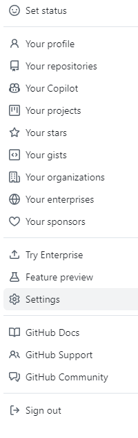

# Getting Started

You will need somewhere to store your remote repsitories. I will be using GitHub. If you don't have somewhere already then hop over to [GitHub](https://github.com) and sign up.

You will also need Git. If you're on linux then you'll find it in whatever package manager you're using. I am on windows so I am using [Git for Windows](https://gitforwindows.org). This also comes with the very handy Git BASH, providing BASH emulation in Windows, which I much prefer to the windows command line. I will, I'm afraid, assume that you are using Git BASH too.

# SSH key
For convenience I recommend generating an SSH key for use with GitHub. It saves on a whole lot of typing out your username and password.

If you don't already have an SSH key (or do, but won't to use a new one for GitHub), then run this command in the BASH terminal:
```
ssh-keygen -t rsa
```
Accept the default file it offers to save the key to, unless you already have a key and don't want to overwrite it.

Now, we need to add the public part of the key to GitHub, so in bash run this:
```
cat .ssh/id_rsa.pub
```
The output will look something like this (no, this is not my actual key...):
```
ssh-rsa AAAAB3NzaC1yc2EAAAADAQABAAABgQCopoPnBENo10erCbO7LQHrvvTUw6SH8oak5iBIo7wC67LoT8uhUSPiehgWnlmx/GgkpJMpxmGVOYrNU9vVFWjkpWitEwbv2vQVoJ0ZXC5cUK9aWID8hKvG4lgbEnPe/tw0pikxwAn4GhD2m/ImM5aBm/WN4y+9RV0sZD1KFrEE9wURUr1jUDNaku3R+C0fkJs/0Vg9Bz+PnzEKeysk1SYA9F/TyudCMeS93+NF1oOTN4oLC8SS3SDk4B++yK/q4Dt7FGxMb94YqgfzlPDRA63TBZYmwzkFmpo1eopk5Z5VEqjETjEsiQJLmdGPH7uDhy+kyrWfmItPmlPPiQS3iBaO5/Z869OjN9iUfeYp4SDweZL/dVgRcs/bHlJeZ1LKubGyPjIvlE4WRrnLTtk792N1/SZb5A/Cvdy/YJUG1Xu/iWxRLK7bhBxKBNwNJnR4Q/iTSZ/Zjg+bzQioLBgzvxx0Zclk1V6d+G7DZZz4VeFp42Xl45z2JKya/vdli/dbrOU= burns@Aragorn
```

On GitHub click on your profile picture (top right corner)


Then click on the settings option



On the left, click on SSH and GPG keys and then near the top right, click New SSH key.


Give your new key a title, and paste the public key in. Click Add SSH key.


That's it! You won't have to type in your user name and password every time you do something to a remote repository using Git.

[Next](2%20-%20Creating%20a%20New%20Repository.md)