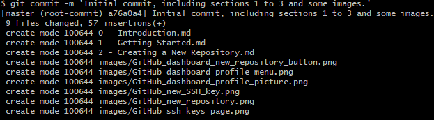

# Creating a Repository

## Step 1
Log in to GitHub and on the dashboard, click the green New button.


## Step 2
Fill in a name for this repository, set it to Private (unless you want the whole world to see it) and, in most cases, tick "Add a README file" where you can put a long description of your repository or perhaps even document it fully.

Then, click Create.


## Step 3
Open Git BASH and cd to, or create, the folder in which your new project is going to live.

Initialise you repository using this command:
```
git init
```

## Step 4 - Add files
```
git add -A
```
The `git add` command tells git which files we want to include in a commit. I've used the -A argument to indicate I want to include all files in the folder.

## Step 4 - Commit
A commit is like a snapshot of these files at this point in time. You might create a commit once you have finished writing a new class or function in your source code, or fix a bug.

We perform a commit using the following command:
```
git commit -m 'Initial commit, including sections 1 to 3 and some images.'
```
The output, in my case, looked like this:



The argument `-m` allows a comment to be include with the commit. Try to keep commits relatively small and these messages simple.

## Step 5 - Add a new remote origin
Now, we need to tell git were our remote copy of this repository will live.

Run the following command:
```
git remote add origin git@github.com:JohnPiatras/JohnsGitGuide.git
```

Replace my username and repository name with your own.

## Step 6 - Push our files to GitHub
Now we need to send our files to GitHub using the push command:
```
git push -u origin master
```

The '-u' ('--set-upstream') flag sets the remote origin as the upstream reference. It means we can later do a 'git push' or 'git pull' without having to specify the origin.

Now, if you go to your repository on GitHub, you should see your files.

## Alternative, lazy way
Do steps 1 & 2 as above.

Then, in git BASH cd to the root folder were you want to store your repository and run:
```
git clone git@github.com:JohnPiatras/JohnsGitGuide.git
```
This will create a folder with the same name as your repository.
Cd into that folder and copy in whatever files make up your project (or start your project).
When ready to commit run:
```
git add -A
git commit -m 'Initial commit comment here'
git push
```

This way skips the git init, setting the origin and the need for the set upstream parameter on the first push as these have already been done by `git clone`.

## Additional
I accidently used \ in my images links, but for them to work on GitHub I needed to use /. So I have done an additional add and commit to fix this.

[Next](3%20-%20Commit%20history.md)