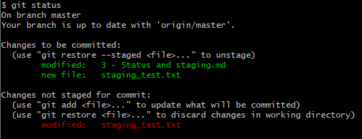
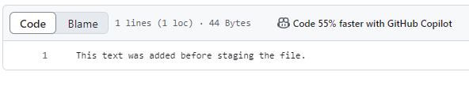
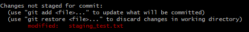
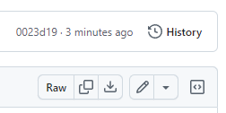
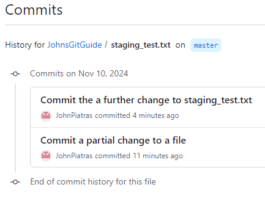
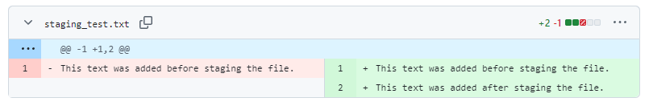

# Status and Staging

In this section I am going to look at how to check the status of my repository, what is staging and controlling what is included in a commit.

I've renamed this section "Commit History" to "Status and Staging". In Git BASH I changed to the repository directory and ran the following:
```
git status
```

Here is the output:


The deleted file and untracked file were actually the same file - I've just renamed it. The change, or deletion, of the original is listed but not staged for a commit. The renamed file is currently untracked.

The above screen shot is also untracked at the moment.

Lets add the file for tracking using:
```
git add 3\ -\ Status\ and\ staging.md
```

But, out of curiosity I'll leave the rest as is, so our status looks like:


So, what happens if we commit and push while our status is like this?

```
git commit -m 'A commit with unstaged changes and untracked files'
git push
```

The files in my Git Hub repository look like this:


The effect of the file rename can be seen - the new file exists. However, it is also there under it's old name as we did not commit that particular change.

Also, if I were to navigate to page 3 - Status and Staging I would see that the images are not showing, as these files are untracked.

My status now looks like:


I can use `git commit -a` to commit currently unstaged changes (the deletion), but this will not cause the 3 untracked images to be added.

For that I need to do `git add -A`, followed by a commit. After doing this and pushing, my git status is now:


All is well, and up to date.

## More about Staging

Staging a file add a snapshot of its current state to the staging environment.

Lets try creating a simple text file with some content, staging it then adding more content and commiting it. What actually ends up being committed?

This is my text file:
```
This text was added before staging the file.
```
I've saved it as `staging_text.txt`.

We can then stage this file using `git add staging_text.txt`.

Now, lets make another change to it, I've added another sentence:
```
This text was added before staging the file.
This text was added after staging the file.
```

Now, run `git status`:



So we have a staged change for the new file, and an unstaged modification.

Helpfully, git tells us exactly what we need to do if we want to unstage our staged change to staging_text.txt. This won't modify the file, but it will move it to untracked (as it is new). We might want to do that if we change our mind and want to make further changes.

I'm not going to do this right now, I'm going to 
```
git commit -m 'Commit a partial change to a file'
git push
```

Then, checking on git hub we can see that the file has been pushed with the first sentence, but not the second:



This demonstrates that staging a change does indeed snapshot the file at that point in time.

`git status` still show a pending change for this file:



I am going to add, commit and push this change.

## Commit history on Git Hub

Having commited some changes to staging_test.txt lets visit Git Hub and see what changed.

If I go to my repo on Git Hub and click the staging_test.txt file I will see it's current contents. Over on the right side of the screen there is a History button.



Clicking it shows a list of commits that modified that file:



Clicking on the topmost commit shows us what changed:



In fact, it actually shows a comparison for every file that changed in that commit.

## Commit history at the command line

Lets add another sentence to staging_test.txt:
```
This text was added before staging the file.
This text was added after staging the file.
Yet another sentence
```

Then, run
```
git diff staging_test.txt
```


This shows what changed from the last staged change and the current version of the file. Oddly, it seems to think I removed and re-added the second sentence, but I didn't.

Note that after doing `git add` for a change, it will not show up when doing `git diff`, we have to use `git diff --cached staging_test.txt` to see the difference between the file and any staged changes.

`git diff HEAD staging_test.txt` will show all staged or unstaged changes since the last commit. `git diff HEAD` will show all changes to all files since the last commit.

I will now stage and commit all changes thus far.

Then, if we do `git diff HEAD` no changes will show.

We can then see what changed between the current commit and the commit before using:
```
git diff master^ staging_test.txt
```

This will show the same changes we saw in the `git diff` screenshot above. Added addtional `^` just after `master` compares the current commit to commits further in the past.