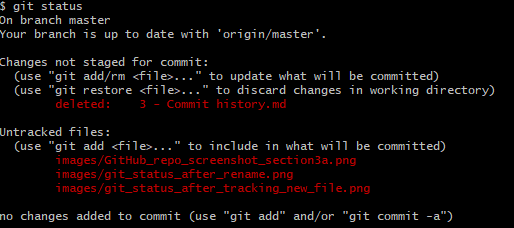

# Status and Staging

In this section I am going to look at how to check the status of my repository, what is staging and controlling what is included in a commit.

I've renamed this section "Commit History" to "Status and Staging". In Git BASH I changed to the repository directory and ran the following:
```
git status
```

Here is the output:


The deleted file and untracked file were actually the same file - I've just renamed it. The change, or deletion, of the original is listed but not staged for a commit. The renamed file is currently untracked.

The above screen shot is also untracked at the moment.

Lets add the file for tracking using:
```
git add 3\ -\ Status\ and\ staging.md
```

But, out of curiosity I'll leave the rest as is, so our status looks like:


So, what happens if we commit and push while our status is like this?

```
git commit -m 'A commit with unstaged changes and untracked files'
git push
```

The files in my Git Hub repository look like this:


The effect of the file rename can be seen - the new file exists. However, it is also there under it's old name as we did not commit that particular change.

Also, if I were to navigate to page 3 - Status and Staging I would see that the images are not showing, as these files are untracked.

My status now looks like:



I can use `git commit -a' to commit currently unstaged changes (the deletion), but this will not cause the 3 untracked images to be added.

For that I need to do 'git add -A', followed by a commit. After doing this and pushing, my git status is now:


All is well, and up to date.
