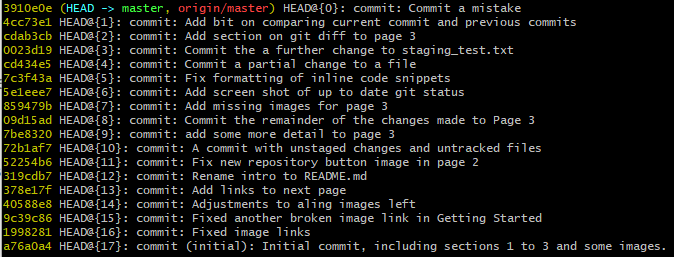
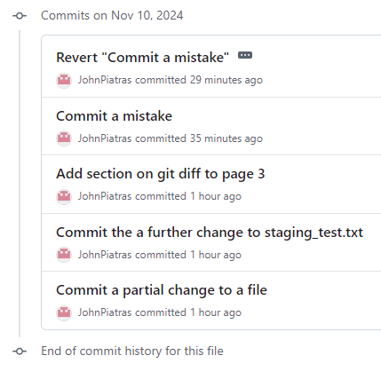

# Reverting a Commit

Mistakes are inevitable. So lets make one and see what we can do.

Lets add another line to staging_test.txt so it now looks like:
```
This text was added before staging the file.
This text was added after staging the file.
Yet another sentence.
Babylon 5's a big pile 'o shit!
```

We'll then `git add staging_text.txt` and then `git commit -m 'Commit a mistake'`.

Now, run `git reflog` for a listing of our commit history:



Our most recent commit is at the top of the list, with ID 3910e0e. Now, having re-assessed our opinions we decide that, maybe, Babylon 5 was actually quite good and that committing to that was something of a mistake. Well, we are in luck. Knowing the ID of a commit, we can undo any changes made in that specific commit.

```
git revert 3910e0e
```
We will be presented with an opportunity to write a commit message, and then history will be undone!

If we `git reflog` we can even see our commit reverting the mistake:


GitHub also shows the revert:



[Next](5%20-%20Branches.md)