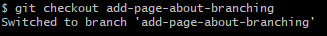
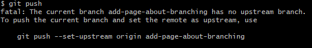
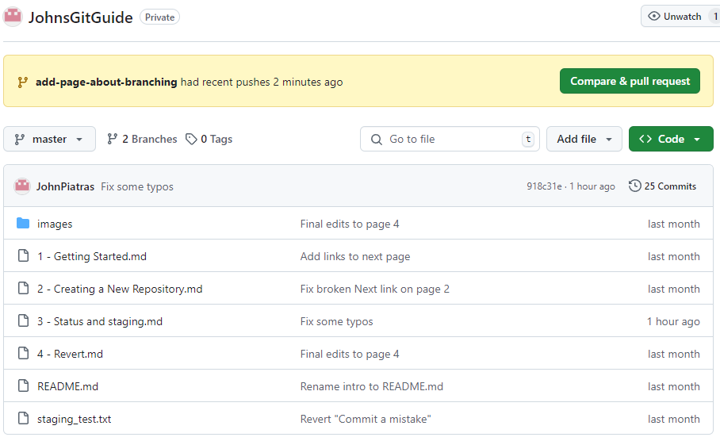
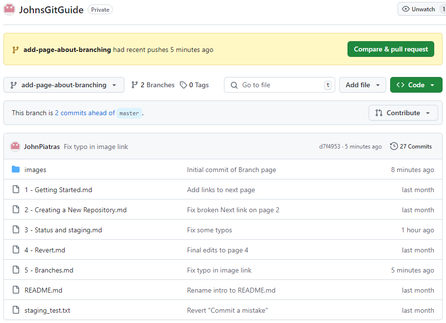

# Branches

A branch is a new and separate version of your git repository. A typical scenario where branching is useful is when adding a new feature to a project. You create a branch for the new feature and work on that feature without affecting the main. 

If, for example, you need to stop working on the new feature and fix a bug in main, you can switch over to the main branch, fix your bug and deploy that fix without ending up with bits of an unfinished feature in your production system. Not only that, but if you switch back to the feature branch and forget about the bugfix, then when the time comes to merge the new feature into the main branch you will also be alerted to the bug fix during the merge process.

## Creating a Branch

Let's create a new branch, in which I will finish writing this page (the new feature).

```
git branch add-page-about-branching
git branch
```

The first command adds a new brach called "add-a-page-about-branching". The second will then list our branches, as shown:


The asterix next to ```master``` indicates that is the branch we are currently on. To switch branch we need to use ```checkout```:
```
git checkout add-page-about-branching
```


At this point I haven't actually started tracking this page or it's screenshots in git, so I'll do a ```git add -A``` followed by ```git commit -m "Intial commit of branch page"```.

Now I want to push this branch to my remote repository:
```
git push
```

It didn't work, but helpfully git tells me why, and offers a solution.



```
git push --set-upstream origin add-page-about-branching
```

Here is what the github page looks like now:



We have a notification about our new branch (more on pull requests soon) and the brach count is now 2, but we are still looking at the master branch, so this page is not shown.

Use the drop down to switch branches:



Now we can see the Branches page, and there is a notification that this branch is 2 commits ahead of master, the 2nd being a fix for a typo commited almost immediately after the initial commit of the branch.

[Next](6%20-%20Pull%20Requests.md)