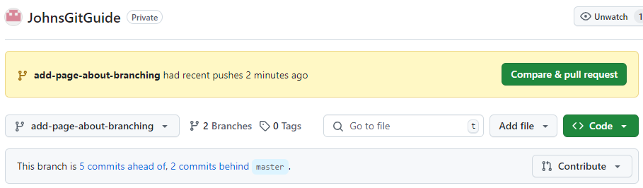
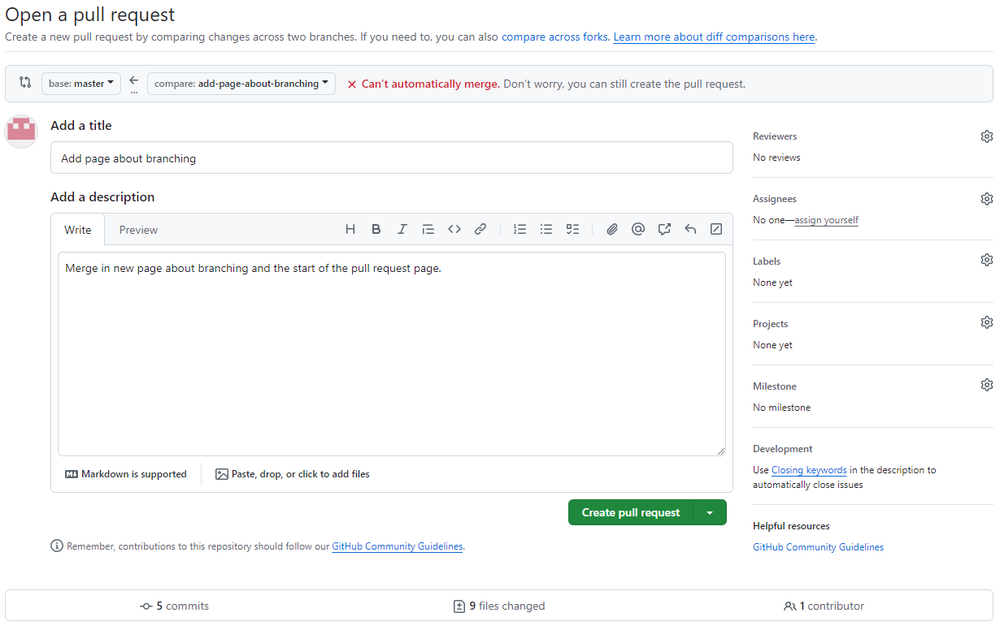
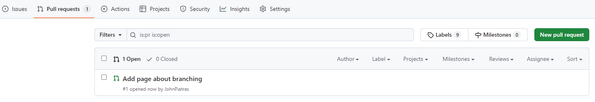
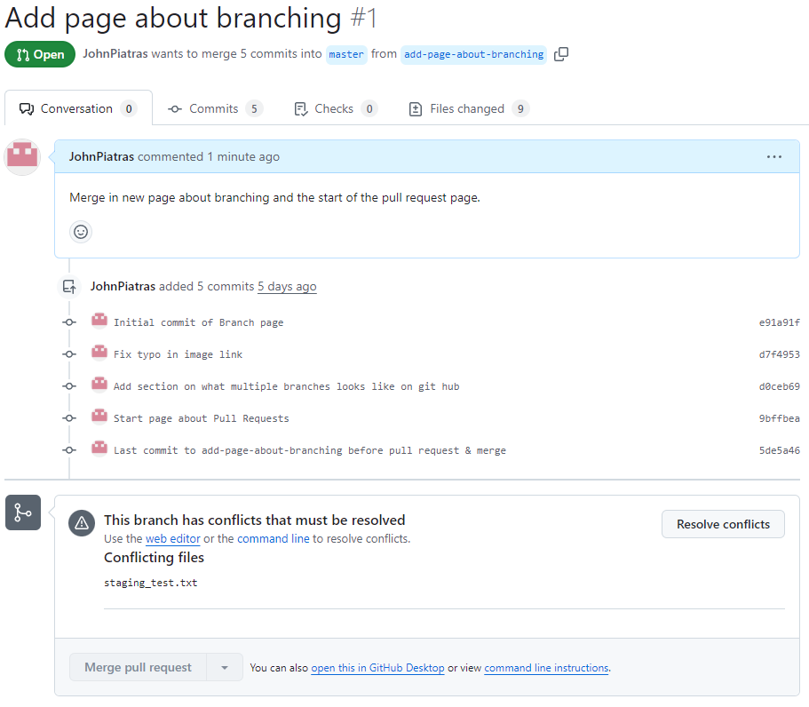
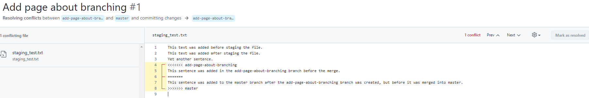
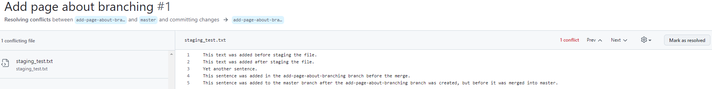
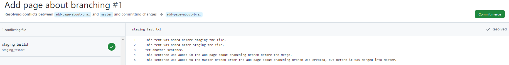
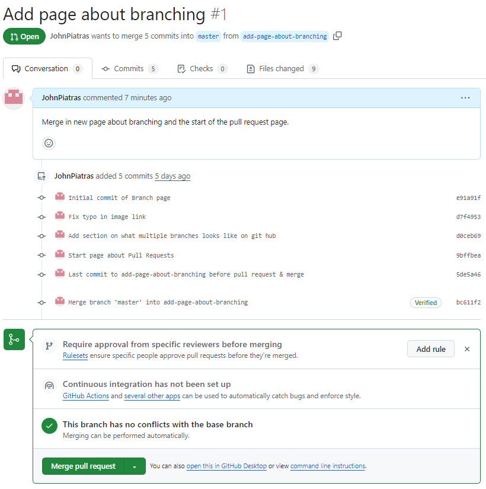
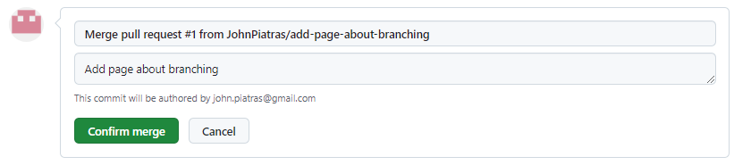
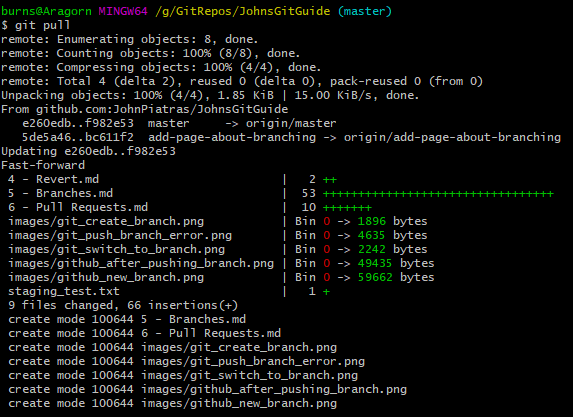

# Pull Requests
Often we will be working as part of a team on a project which means that one person may be working on new feature in a branch, will someone else works on other features or bug fixes in another branch.

Eventually the time will come to merge your branch in to master, but master may have had commits made that your branch does not.

This is were the Pull Requests come in - we want to pull changes into master.

To simulate this I briefly checked out master and added a sentence to the ```staging_test.txt``` file I created earlier which was then commited and pushed to the remote repository. I have since checked out out ```add-page-about-branches``` again to write this page about Pull Requests. This branch does not contain the edit to ```staging_test.txt```.

I am now going commit what I have in this branch, and push that to the repository as well, create a pull request and merge everything back to master while taking screenshots along the way.



Looking at the repository on GitHub we can see that this branch has 5 commits not present in master, and that master is 2 commits ahead of this branch.

Click "Compare & pull request" to go to the "Open a pull request" page.



Add a description and click "Create pull request". After doing this you will be taken directly to the new pull request, but lets go to the Pull Request tab instead. This tab shows all open pull requests by default and is where we would go to see pull requests submitted by other contributers.



Clicking on our pull request will open it:



Here we can see the commits in this request, and conflicts which need to be resolved. Conflicts may happen if changes (eg bug fixes, or a feature developed independantly of this branch) are made in master that are not present any the branch.

We must resolve the conflicts to continue, so click the button.



The sections marked with ```<<<<<<<``` and the red-lines are conflict markers. The Resolve Conflict button will remain greyed-out until you remove these markers. So, we edit the file in GitHub, removing the conflict markers and keeping the content we want.



Now, click ```Mark as resolved``` followed by ```Commit merge```.



The next page to open is ```Merge pull request```:



Since we have resolved the conflicts, we can now click ```Merge pull request```.



Then click ```Confirm merge```.

Finally, in our local repository we switch to the master branch and pull down the changes:
```
git checkout master
git pull
```



Which fast forwards our local repository to the most recent commit in master, which is were the merge has happened.