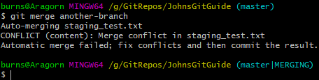
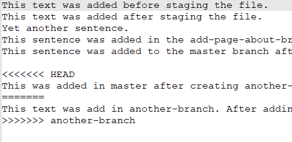
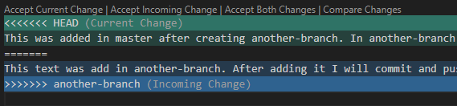
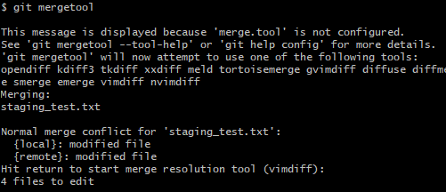
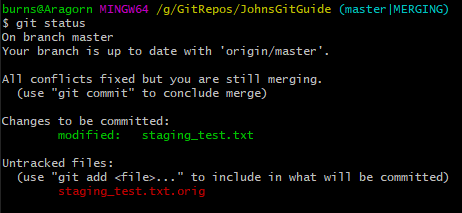
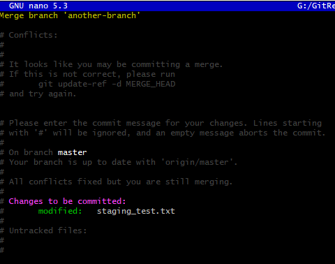

# Merging a branch on the command line

We can also merge branches on the command line.

To demonstrate, I have made an edit to staging_test-txt in the master branch, and a different edit in a new branch called another-branch.

Changes in both branches have been commited and pushed to the remote repository.

## Starting the merge

First, we switch to the master branch.
```
git checkout master
```

Then, we run 
```
git merge another-branch
```

Git will attempt to auto-merge the branches, but as we have two different edits to the same file, this will fail.



If we open ```staging_test.txt``` in notepad++ we will see the conflict markers we saw in the previous section.



As it happens VS Code, which I am writing this in, offers to help handle merge conflicts too:



Finally, we can also try this command:
```
git mergetool
```



After pressing enter it launch ```vimdiff``` which I have no idea how to use, and will not be covering here.

Anyway, the simplest option is to edit the file as we did on GitHub, removing the conflict markers and keeping whichever change we want. I have kept both and saved the file.

Lets check our git status now:



Git knows we are still performing a merge, and recognises that the conflict has been resolved so we can now commit this change.

```
git commit
```



Since we didn't use the message parameter, git asks for a commit message. I'm happy with the message, and knowing how to use nano, just press ctrl-x to save and exit.

Afterwards do a ```git push``` to push our merge to the remote repository.

