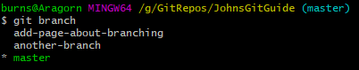
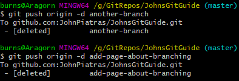

# Deleting a branch

I now have 3 branches, 2 of which have been merged into master and are no longer needed.



I am currently on master, but if I wasn't I would have to do a ```git checkout master``` before continuing.

I am now going to delete both branches locally:

```
git branch -d add-page-about-branching
git branch -d another-branch
```

As I've already commited all changes in these branches and merged them they delete without any issues. If they had unmerged changes or unpushed commits then git would error with a message stating as much.

At this point you should either commit your changes, merge and push them. However, if you are absolutely sure you don't want these changes then you can force delete them using:

```
git branch -D another-branch
```

## Deleting a remote branch

I have only deleted my local copy of these branches. To delete them remotely I must run:

```
git push origin -d another-branch
```



That's it for deleting branches, pretty straight forward.